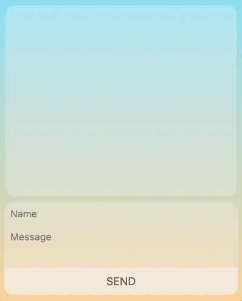
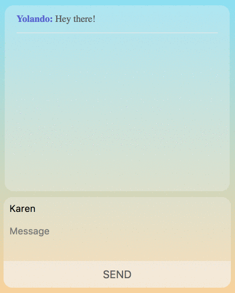
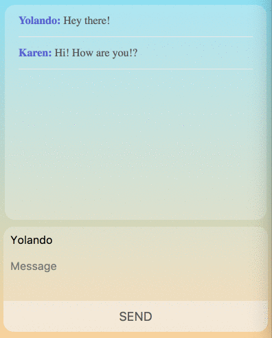

# Chat Application

This is a simple chat app using socket.io.

The user can type in their name and a message. Clicking send or "enter" will make their message live.

Anyone joining the chat is able to correspond with the other users.

The chat will even show if anyone in the group is currently typing a message

Other technologies used:
1. HTML
2. CSS
3. Javascript
4. Node.js
